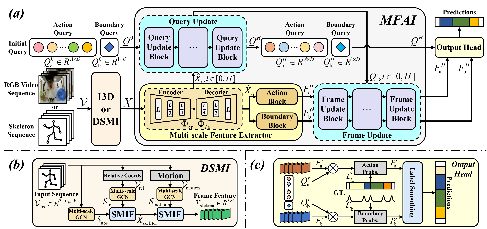

# Interaction Makes Better Segmentation: an Interaction-based Framework for Temporal Action Segmentation

> **Abstract:** *Temporal action segmentation (TAS) aims to classify the action category of each frame in untrimmed videos, with RGB videos or skeleton sequences as common inputs. Most existing methods follow a two-stage pipeline of feature extraction and temporal modeling. However, we observe two key limitations in their spatio-temporal modeling: (i) Existing temporal modeling modules conduct frame-level and action-level interactions at a single fixed temporal resolution, which over-smooths temporal features and blurs action boundaries; (ii) Skeleton-based methods generally adopt temporal modeling modules originally designed for RGB video data, causing a misalignment between extracted features and temporal modeling modules. 
To address these issues, we propose a novel **Inter**action-based framework for **Act**ion segmentation (**InterAct**). Firstly, we introduce multi-scale frame-action interaction (MFAI) to facilitate frame-action interactions across varying temporal scales. This enhances the model's ability to capture complex temporal dynamics, producing more expressive temporal representations and alleviating the over-smoothing issue. Meanwhile, recognizing the complementary nature of different spatial modalities, we further propose decoupled spatial modality interaction (DSMI). It decouples the modeling of spatial modalities and applies a deep fusion strategy to interactively integrate multi-scale spatial features. This results in more discriminative representations that better support temporal modeling. 
Extensive experiments on seven large-scale benchmarks show that InterAct significantly outperforms state-of-the-art methods on both RGB-based and skeleton-based TAS. Further evaluations on multi-person interactions and simulated occlusions demonstrate improved robustness under imperfect skeleton observations.* 

<div align="center">
  
  <br>
  <em style="font-size: 0.9em; color: #666;">
    Figure 1: Overview of the InterAct framework.
  </em>
</div>

## Introduction
This repo is the official PyTorch implementation for ''Interaction Makes Better Segmentation: an Interaction-based Framework for Temporal Action Segmentation''.

## Dependencies and Installation
- Python: 3.9.18
- PyTorch: 2.0.1
- torchvision: 0.15.2

For example:
1. Clone Repository
```bash
git clone https://github.com/gdxxu/InterAct-main.git
```
2. Create Conda Environment and Install Dependencies
```bash
conda env create -f environment.yml
conda activate InterAct
```

## Preparation
### Datasets
- **RGB-based datasets**: Available from the [MS-TCN repository](https://github.com/yabufarha/ms-tcn).
- **Skeleton-based datasets**: 
  - All datasets except PKU-MMDv1 can be downloaded from the [DeST repository](https://github.com/lyhisme/DeST).
  - PKU-MMDv1 dataset is available from its [official website](http://39.96.165.147/Projects/PKUMMD/PKU-MMD.html).

Unpack the file under `./data` (or elsewhere and link to `./data`).

## Pre-Trained Models
Pre-trained model weights can be downloaded from [here](https://pan.baidu.com/s/1gdObJN_BgyQlS72P-NOfZw?pwd=faex). You can place the files under `./ckpt`.

The folder structure should look like
```
├── config/
│   └── PKU-subject/
│       └── config.yaml
├── data/
│   └── PKU-subject/
│       ├── features/
│       ├── groundTruth/
│       ├── gt_arr/
│       ├── gt_boundary_arr/
│       ├── splits/
│       └── mapping.txt
├── ckpt/
│   └── PKU-subject/
│       ├── config_result/
│           └── best_test_model.pth.tar
├── libs/
├── main.py
└── eval.py
```

## Get Started
### Training
You can train a model by changing the settings of the configuration file.
```shell
python main.py config/xxx/config.yaml --output result
```
Example:
```shell
python main.py config/PKU-subject/config.yaml --output result
```
### Evaluation
You can evaluate the performance of result after running.
```shell
python eval.py config/xxx/config.yaml ckpt/xxx/config_result
```
Example:
```shell
python eval.py config/PKU-subject/config.yaml ckpt/PKU-subject/config_result
```

## Acknowledgement
Our work is closely related to the following assets that inspire our implementation. We gratefully thank the authors.

- ASRF: https://github.com/yiskw713
- ETSN: https://github.com/lyhisme/ETSN
- DeST: https://github.com/lyhisme/DeST
- ASQuery: https://github.com/zlngan/ASQuery
- FACT: https://github.com/ZijiaLewisLu/CVPR2024-FACT

## License
This project is licensed under the MIT License. 
